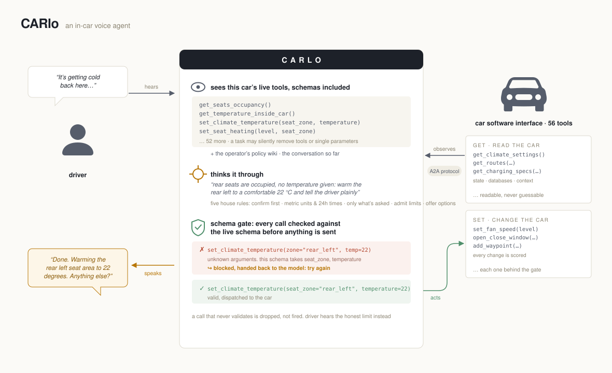
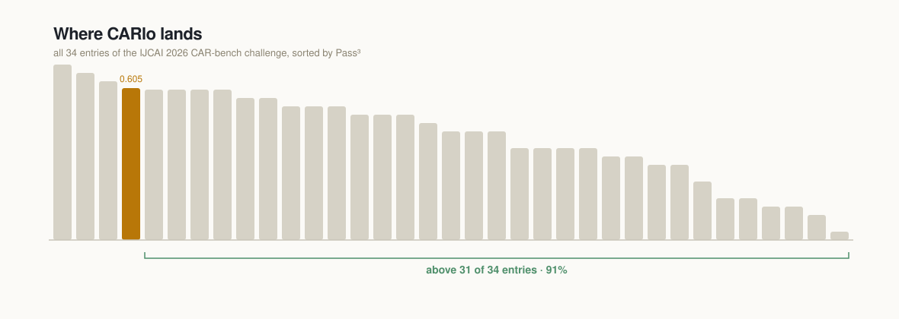

# CARlo

A `gemini-3.5-flash` agent for **CAR-bench** (IJCAI-ECAI 2026 Track 1). The deployed
configuration is deliberately **minimal**: schema-validated tool calls with in-turn retry, an
inventory-grounded capability check, five general behavior rules, temperature 0, high reasoning
effort. It beats the raw-model baseline on the full training split (Pass^3 0.605 vs 0.566) at
about $0.25 per episode.

The original six-gate scaffold is still in the codebase behind the default (non-minimal) path —
kept as the A/B arm that the eval-driven loop convicted and retired. The full story (verdicts,
trace forensics, cost ledger) lives in `../.mutagent/`.

> Implements `spec_id: carlo` — see `../.mutagent/specs/carlo/agentspec.yaml` (AgentSpec 0.3.0) and
> its decision log `agentspec.decisions.md`. The spec is the source of truth; this implementation
> points **up** to it and never the other way around.

## What the agent sees and does



## Where it lands



CARlo self-evaluated on the public 129-task training split; challenge entries were
organizer-scored on a hidden task set. Indicative, not an official entry.

## Shape

One TypeScript core, two thin entrypoints over the **same wire**:

```
                        ┌──────────────────────────────────────────┐
 CAR-bench evaluator ──▶│  src/a2a/server.ts   (PRIMARY, Docker)   │
   (A2A 1.0 JSON-RPC)   │      wire → executor → pipeline           │
                        │                                          │
 local run.py       ──▶ │  bridge/carlo_bridge.py ──HTTP──▶ (same)  │
   (Python factory)     └──────────────────────────────────────────┘
```

- `src/pipeline.ts` — the per-turn loop. With `CARLO_MINIMAL=1` (the deployed arm):
  **ingest → draft (1 backbone call) → schema-validate (in-turn retry ≤4, strip if never valid) →
  emit**, bounded at 50 turns with a clean close. Without the flag, the retired six-gate path
  (feasibility / ambiguity / policy pre-check / arg self-check / verify) runs instead.
- `src/validator.ts` — per-call validation against the **live** tool inventory (tool exists, args
  declared, required args present) plus the parameter-absence check (`checkFieldParity`) that
  catches tools whose single parameter a task removed — the trap raw models step into.
- `src/prompts.ts` — evaluator policy verbatim first, CARlo's operative rules, then (minimal mode)
  the five-bullet behavior block. The bullet count is load-bearing; see the comment there.
- `src/backbone/vertex.ts` — `@google/genai` in Vertex mode, temperature 0, Gemini-3.x
  `thinkingConfig.thinkingLevel` mapping, transient-error retry (walks the `cause` chain —
  bun/undici reports timeouts as `fetch failed` + `ETIMEDOUT` on `cause`), per-turn token
  accounting.
- `src/a2a/*` — the A2A 1.0 wire (strict allowlist encoder), agent card, per-`contextId` state.
- `bridge/` — a minimal Python adapter implementing CAR-bench's `Agent` ABC for local runs, evals
  and the baseline measurement, plus `remaining_tasks.py` for resumable runs.
- `scripts/cost-report.ts` — token-accurate cost ledger from traces + harness checkpoints
  (`bun run cost`), written to `../.mutagent/costs/ledger.json`.

## Requirements

- **bun** 1.3+ (runtime and test runner)
- **Docker** for the submission image
- **Vertex AI access**: `gcloud auth application-default login`, plus a project with the model
  enabled. Python 3.11+ and `uv` only if you use `bridge/`.

## Configuration (env vars only)

Every model/provider knob is env-configurable — a competition requirement. Never bake secrets into
the image. See `.env.example`.

| Variable | Default | Notes |
|---|---|---|
| `CARLO_MINIMAL` | `false` | **`1` = the deployed arm**: gates off, schema-validate + retry on, behavior rules appended, thinking derived HIGH |
| `CARLO_MODEL` | `gemini-3.5-flash` | spec-pinned backbone |
| `CARLO_TEMPERATURE` | `0` | Pass^3 punishes variance |
| `CARLO_THINKING_BUDGET` | `0` (`-1` in minimal mode) | `-1` maps to `thinkingConfig.thinkingLevel` on the wire — Gemini 3.x takes `thinking_level`, not `thinking_budget`; sending both errors |
| `CARLO_THINKING_LEVEL` | derived (`HIGH` in minimal mode) | explicit `MINIMAL\|LOW\|MEDIUM\|HIGH` override. The MEDIUM control arm measurably loses the hallucination gains — HIGH is the causal lever |
| `CARLO_MAX_TURNS` | `50` | spec `maxIterations`, matches the official `max_steps` |
| `CARLO_VERIFY_MODE` | `risk` | legacy arm only; ignored in minimal mode |
| `CARLO_GROUNDEDNESS` | `false` | legacy experiment, measured harmful on disambiguation; keep off |
| `CARLO_TRACE_DIR` | `traces` | relative path; the eval/diagnose evidence sink |
| `GOOGLE_CLOUD_PROJECT` | — | required for a live run |
| `GOOGLE_CLOUD_LOCATION` | `global` | **`gemini-3.5-flash` resolves only at `global`** (404 at `us-central1`/`us-east5`) |
| `GOOGLE_GENAI_USE_VERTEXAI` | `true` | `GOOGLE_GENAI_USE_ENTERPRISE` is also accepted |
| `HOST` / `PORT` | `127.0.0.1` / `8080` | the Docker image binds `0.0.0.0` |

## Run

```bash
bun install

# The deployed configuration (minimal arm)
CARLO_MINIMAL=1 GOOGLE_CLOUD_PROJECT=<project> GOOGLE_CLOUD_LOCATION=global bun run src/a2a/server.ts
# banner must read: ... minimal=true thinkingLevel=<derived> ...

# Docker, as the organizers run it
docker build --platform linux/amd64 -t ghcr.io/<org>/carlo:latest .
```

Traces land in `$CARLO_TRACE_DIR` (default `traces/`), one JSONL file per task: draft, validation
retries, emitted step, usage. Use a distinct trace dir per experiment arm so corpora stay
separable (`bun run cost` attributes them to runs).

## Verify (BUILD gates — all hermetic)

```bash
bun x biome check src tests     # lint
bun x tsc --noEmit              # typecheck
bun test                        # unit + wire + server tests, MOCKED backbone
bun build src/a2a/server.ts --target=bun --outdir=dist

# Bridge tests + the target smoke against the REAL pinned harness
bridge/.venv/bin/python -m pytest bridge/test_bridge.py -q
```

No gate makes a live model call or runs the benchmark. The golden A2A fixtures under
`tests/fixtures/golden/` are generated by the **genuine** Python `a2a-sdk` serializer
(`bridge/gen_golden_fixtures.py`), and `test_bridge.py` re-parses our responses with the same strict
`ParseDict` the evaluator uses — including negative cases proving a polluted message is rejected.

## EVALUATE (live; not part of BUILD)

```bash
# One-time setup
git clone https://github.com/CAR-bench/car-bench.git third_party/car-bench   # pinned: 111df1c9
cd bridge && uv venv .venv && VIRTUAL_ENV=.venv uv pip install -e ../third_party/car-bench a2a-sdk httpx pytest

# 1) MEASURE THE BASELINE FIRST — it defines the success bar
bridge/.venv/bin/python bridge/run_baseline.py --task-type all --task-split train --num-trials 3

# 2) The agent, same harness/splits/trials
CARLO_MINIMAL=1 bun run src/a2a/server.ts &
bridge/.venv/bin/python bridge/run_local.py --task-type all --task-split train --num-trials 3
```

The harness's simulated user and policy judge need **their own** credentials (`GEMINI_API_KEY`, or
`--user-model-provider vertex_ai`); that is the evaluator side, not CARlo's backbone. When the
sim/judge model is `gemini-3.5-flash` on Vertex, also export `VERTEXAI_PROJECT` and
`VERTEXAI_LOCATION=global` — the harness's LiteLLM calls otherwise default to `us-central1`, where
the model 404s. The public **test** split is a milestone-only holdout — never tune against it.

Note on evaluator fidelity: our corpora were scored with a `gemini-2.5-flash` sim/judge (the
harness default); the official challenge evaluator locks both to `gemini-3.5-flash`. A/B
comparisons here are internally consistent; absolute numbers are not leaderboard-comparable. A
30-task probe under the 3.5-flash sim confirmed the minimal-arm win holds (21/30 vs 19/30).

## Results (train split, 129 tasks × 3 trials, identical harness both arms)

| Pass^3 | CARlo minimal | raw gemini-3.5-flash | six-gate arm |
|---|---|---|---|
| base | 0.700 | 0.720 | 0.44 |
| hallucination | **0.542** | 0.458 | 0.417 |
| disambiguation | **0.548** | 0.484 | 0.26 |
| **overall** | **0.605** | 0.566 | 0.388 |

Verdicts and diagnosis: `../.mutagent/evaluator/` and `../.mutagent/diagnostics/`.

## Submission

`scenarios/scenario.toml` is the template: official evaluator image, a **public digest-pinned** GHCR
agent image, env var **names** only, `task_split = "hidden"`, all counts `-1`, `num_trials = 3`.
Replace the placeholder digest with your pushed image before submitting.

## Sources

Conventions were taken from these, crawled fresh at build time:

- [car-bench](https://github.com/CAR-bench/car-bench) — the `Agent` ABC, `run.py` custom-agent
  factory, orchestrator loop, reward fields
- [car-bench-ijcai](https://github.com/CAR-bench/car-bench-ijcai) — the A2A turn contract, harness
  boundaries, submission shape (`docs/development-guide.md`, `docs/agent-under-test-harnessing.md`)
- [A2A specification](https://github.com/a2aproject/A2A) `specification/a2a.proto` — the exact
  `Message`/`Part` field names the strict encoder emits
- [js-genai](https://googleapis.github.io/js-genai/) — Vertex mode, `parametersJsonSchema`,
  `automaticFunctionCalling`, `thinkingConfig`, `usageMetadata`
- [Thylinao / team-28 report](https://car-bench.github.io/car-bench/reports/track_1/team-28.pdf) —
  the minimal-harness recipe and the prompt-interference lesson, mined during ④ DIAGNOSE
