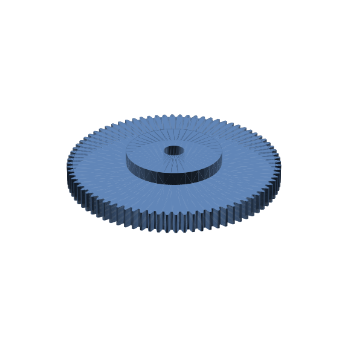
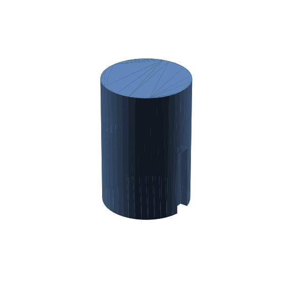
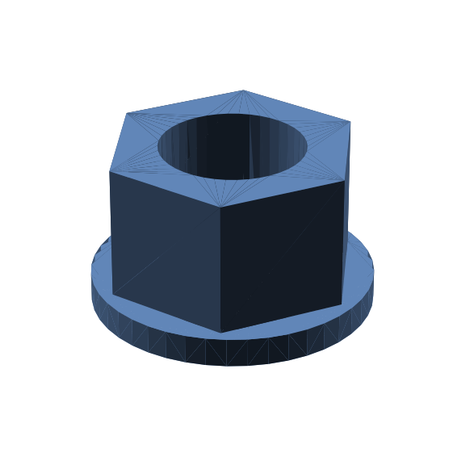
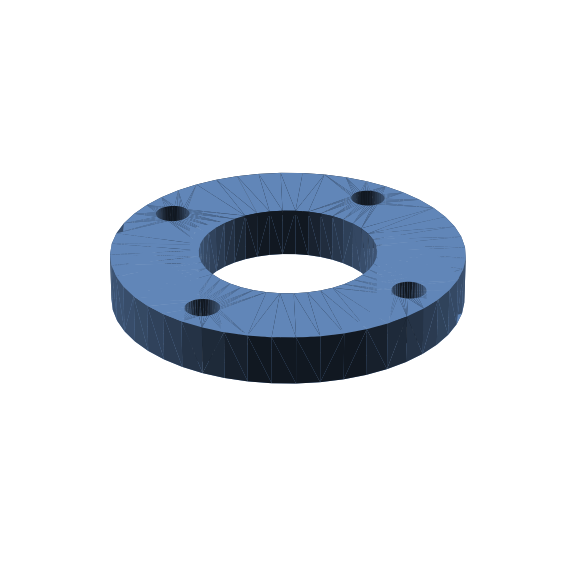
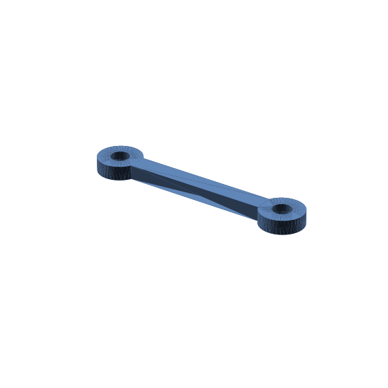
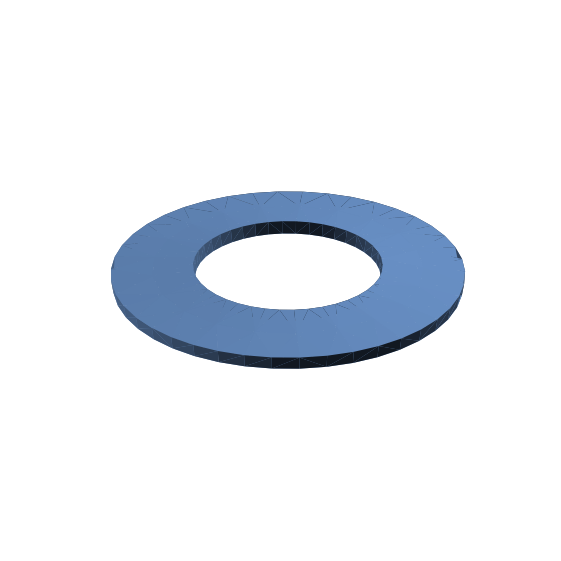
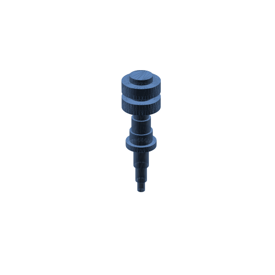
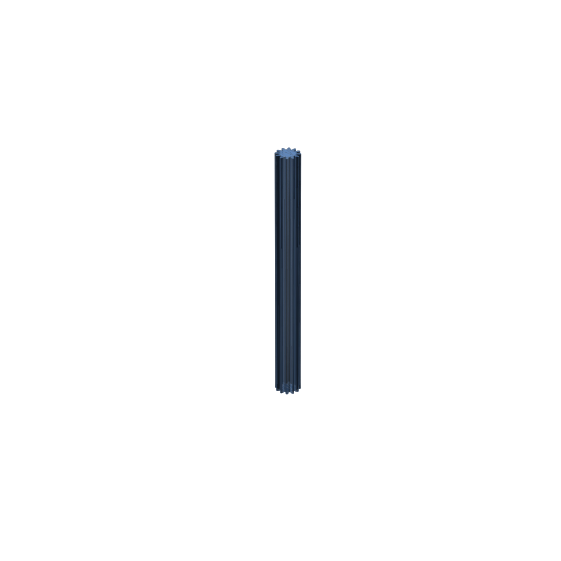

# freecad-engineer

A **self-verifying mechanical-CAD agent**: stock Claude Code + Opus 5, briefed by a
single markdown definition, that turns a natural-language part specification into a
parametric FreeCAD PartDesign script — and proves its own output before finishing.

**The agent definition is one file: [`harness/freecad-engineer.md`](harness/freecad-engineer.md).**
There is no custom orchestration code and no fine-tuning — the file is appended to each
task prompt and carries the entire design:

- a hard output contract (one parametric `PartDesign::Body`, one solid, no baked shapes,
  script must derive its own output path and actually be executed);
- a working method: plan → write ONE good script → execute → verify → fix;
- a verification loop — an analytic volume/bbox cross-check against hand-derived
  expectations, plus a self-check with a public PyPI FreeCAD validator (spec-consistency
  and a geometry gate), with explicit rules for reading its output as a floor, not a verdict;
- parameter-interpretation defaults (through-holes, diameters vs radii, unit expressions,
  no unrequested cosmetic features);
- family drafting conventions (shafts, keyways, nuts, flanges, involute gears, splines,
  pins, bearing rings, disc springs, …) and a tested spur-gear profile builder to copy.

`harness/` also holds the runners (`run_slice.sh` / `run_batch.sh` — harbor-based, one
Docker container per task) and offline scorers.

## Results scorecard

Evaluated on the [gNucleus Parametric CAD Bench](https://cadbench.ai) — 100
text-to-CAD tasks, FreeCAD 0.21.2, scored as the harmonic mean of geometry similarity
and spec consistency. One full first-attempt-only run (no retries, no task repeats),
2026-08-19, versus the public leaderboard:

| Rank | Model + agent | Combined | Geometry | Spec | Cost |
|---|---|---|---|---|---|
| — | **freecad-engineer** — claude-opus-5 (high) + claude-code (not yet submitted) | **0.9605** | **0.9519** | 0.9947 | **~$71** |
| 1 | claude-opus-5 (max) + claude-code | 0.906 | 0.889 | 0.972 | $113.24 |
| 2 | grok-4.6 (xhigh) + mini-swe-agent | 0.888 | 0.852 | 0.972 | $119.46 |
| 3 | grok-4.6 (xhigh) + grok-build | 0.884 | 0.843 | 0.967 | $76.60 |
| 4 | gpt-5.6-sol (max) + codex | 0.865 | 0.848 | 0.943 | $97.58 |
| 5 | grok-4.5 (high) + grok-build | 0.837 | 0.802 | 0.941 | $36.59 |

Leaderboard rows from [cadbench.ai](https://cadbench.ai) (last updated 2026-08-14,
retrieved 2026-08-19). freecad-engineer additionally scored 90/100 tasks at a perfect 1.0.

Per-task provenance: `harness/generic_run_scores.json`. One live-verifier flake is
corrected from an offline re-grade with the task's own scorer (noted in the file).

## Sample renders

Geometry the agent produced, rendered headless from the output `.FCStd` files
(`harness/render_parts.py` regenerates these):

| | |
|---|---|
|  spur gear, z = 80 |  shaft with two keyways |
|  hex flange nut |  round mounting flange |
|  connecting rod |  disc spring |
|  11-section stepped shaft |  gear stock, z = 12, with undercut |

Methodology note, stated openly: the family conventions in the definition were calibrated
offline against the benchmark's public reference geometry, so these numbers are a
tuned-agent result rather than a cold pass@1. The evaluator and diagnostics artifacts
below document this.

## ADL stages covered

| Stage | Artifact | Notes |
|---|---|---|
| ① SPEC | `.mutagent/specs/freecad-engineer/agentspec.yaml` | Cold-constructed retroactively via `*sync-spec` (ai-architect), passes `*validate-spec` (AgentSpec 0.3.0) |
| ② BUILD | `.mutagent/specs/freecad-engineer/build-report.md` | The ai-architect build-verify review (verdict STEER, 11 findings) exported verbatim from the session transcript, with the applied-fix disposition. The build itself was hands-on in-session — there is no builder-scaffold report |
| ③ EVALUATE | `.mutagent/evaluator/run-cadbench-slice-01/` | 8-trajectory slice: deterministic tier-0 re-grades + 48 judge cells, gate **PASS** (45/48). Trace intake was harbor trial dirs, not UniTF (recorded as a deviation in the scorecard) |
| ④ DIAGNOSE | `.mutagent/diagnostics/reports/run-generic01-diag-01/` | Full orchestrator-protocol run over the 11 sub-1.0/flake trials of the latest benchmark run: UniTF handover (`.mutagent/traces/generic01-sub1/`), single-shot analyzer, 6 findings, all gates green (finalize gate CRIT-clean). Report-only target — no auto-apply |
| ⑤ OPTIMIZE | — | Not run as a toolchain stage. The optimize loop happened in-session (STEER findings + evaluate verdicts fed definition revisions by hand) |
| ⑥ SHIP | — | Not run |

`.mutagent/config.yaml` was written retroactively for the DIAGNOSE run (the project
predates onboarding); earlier stages ran on documented agent-dispatch defaults. Historical
artifacts inside `.mutagent/` refer to the agent by its working name from the build
sessions (`cadbench-crusher`) — they are committed as the toolchain wrote them.

## How to run it

Requires the benchmark's harbor task suite and Claude Code:

1. Download the cad-bench tasks into `tasks/cad-bench/` and create a harbor venv
   (`harbor` + docker). Two local harbor patches are load-bearing and preflight-checked
   by the runner: a reward-json numeric filter in `verifier/verifier.py` and a
   `len(secret) < 8` guard in the `trial.py` secret scrubber.
2. Auth: `run_slice.sh` forwards your local Claude Code credentials into each trial
   container (`CLAUDE_FORCE_OAUTH=1` + a token read fresh from `~/.claude/.credentials.json`).
3. Optional speed-up: place a Claude Code ELF at `harness/prebaked/claude` — it is
   bind-mounted into each trial container and skips the ~5-min per-trial install.
4. Run: `harness/run_slice.sh <job-name> ALL` (or task ids; `N=1..4` concurrency,
   `EFFORT=high|max`). Score offline: `harness/score_all.py` / `harness/score_offline.py`.

No other environment variables.

## Last verified

2026-08-19, full 100-task run (`generic-01`), harbor + FreeCAD 0.21.2 task images,
Claude Code 2.1.231, claude-opus-5 at reasoning effort high. MutagenT: Helix
0.1.0-alpha.18 skill bundle (agentspec · builder · evaluator · diagnostics).
